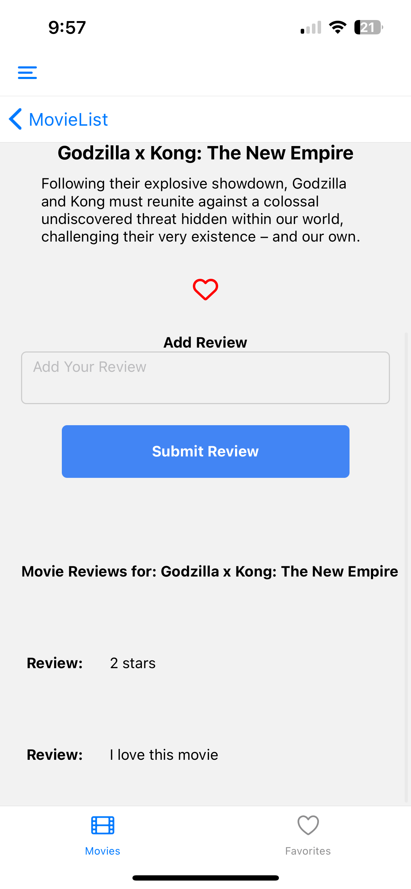

# Project Name
Pop Movie Rater

## Description

PopMovieRater is a demo React Native Expo App that is designed to demonistrate my React Native skills in INF657 Mobile Web Development II. I used TMDB
to pull an API list of popular movies  and display to a user.

Firebase Authentication and firestore from Firebase was used as a way of handling authenication and storing data. 
The user can create a user, login and out, and store information about movies in the application. 


## Installation
package.JSON with npm i

1. **Clone Repository:** 
    ```bash
    git clone https://github.com/cierra00/PopMovieRater.git
    ```


3. **Install Dependencies:**
    ```bash
    npm install
    ```

## Usage

npm start
use Android, Web, or IOS emulators, or use the expo app installed onto your device. 

1. open the directory with Bash/powershell/etc and type npm i. After dependancies are installed, then use npm start to load the expo React Native application. 
The easiest way to get the app up and running is to install the expo go app on your appstore. Then you would just scan the qr code in the terminal window. 
If you have an emulator installed on your computer, just follow directions that Expo Go will display in the terminal

## Contributing

Youtube Demo Link: 
https://youtu.be/F4N--2JIAW0

#Screenshots
You can see all screen shots in the DemoImages/ directory if these don't show up!





